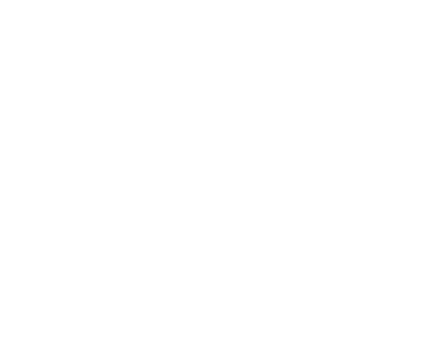

# OverScry Introduction

### 🔍 The magic lens for Overpass queries

OverScry is a tool designed to simplify the process of generating Overpass queries from a YML structure file. By taking a structured YML input that defines specific geographical data and search parameters, OverScry automatically converts it into a valid Overpass query. Overall it makes it easier for both beginners and experts to leverage Overpass API capabilities without needing to understand how to write complex raw queries.

---

## Test the online version of the tool [here](/online/)

#### Supports

    
    
    
    
    
    

